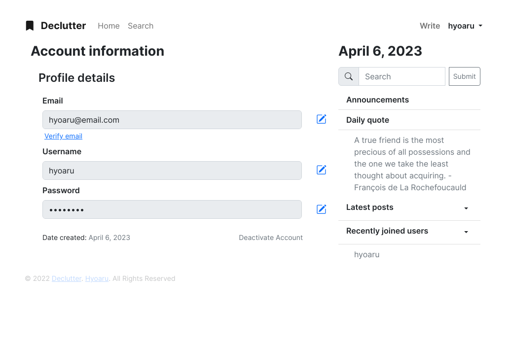

# Declutter
Declutter is a web application that provides a platform for users to write and share their thoughts in a clutter-free space. The website is built around the notion of decluttering your mind by writing, enabling users to organize their thoughts, ideas, and feelings through writing.
* See live at - https://declutter.up.railway.app

## User interface
The Declutter interface is user-friendly, making it easy for users to start writing immediately. The platform is designed to inspire users to write and share their thoughts, with features such as daily writing prompts, a community forum, and a collection of inspirational quotes to keep users motivated.

One of the unique features of Declutter is its minimalist design. The website has a clean, uncluttered look, which helps users focus on their writing without any distractions.





## More about declutter
Declutter is a perfect platform for individuals who are looking to declutter their thoughts and find a creative outlet for their emotions. Whether it's jotting down ideas, writing about personal experiences, or sharing inspirational stories, Declutter provides a safe and supportive space for users to express themselves freely.

## Project structure
```
└── declutter
    ├── blueprints
    │   ├── admin
    │   ├── authentication
    │   │   ├── forms
    │   │   └── utilities
    │   ├── errors
    │   ├── main
    │   ├── posts
    │   │   └── forms
    │   └── users
    │       ├── account
    │       │   ├── forms
    │       │   └── utilities
    │       └── general
    ├── data
    ├── database
    ├── models
    ├── static
    │   ├── css
    │   ├── favicon
    │   ├── images
    │   └── pages
    │       └── errors
    │           └── resources
    │               └── images
    ├── templates
    │   ├── admin
    │   ├── authentication
    │   ├── errors
    │   ├── layout
    │   │   ├── default
    │   │   └── defined
    │   ├── main
    │   │   └── search
    │   ├── posts
    │   └── users
    │       ├── account
    │       └── general
    └── utilities

40 directories
```

## Environment variables
| Name                    | Description                                                                                                     |
| ----------------------- | --------------------------------------------------------------------------------------------------------------- |
| SECRET_KEY              | Cryptographic key used for securely signing session cookies, which are used to store user data between requests |
| FLASKMAIL_MAIL_USERNAME | Username or email for your flask mail service                                                                   |
| FLASKMAIL_MAIL_PASSWORD | Password for your flask mail service                                                                            |
| SQLALCHEMY_DATABASE_URI | String that specifies the database connection details in a standardized format                                  |

## Dependencies
* alembic==1.8.1
* argon2-cffi==21.3.0
* argon2-cffi-bindings==21.2.0
* bcrypt==3.2.2
* blinker==1.5
* brotlipy==0.7.0
* certifi==2022.12.7
* cffi==1.15.1
* charset-normalizer==2.1.1
* click==8.1.3
* cryptography==38.0.2
* dnspython==2.2.1
* email-validator==1.3.0
* Flask==2.2.2
* Flask-Admin==1.6.0
* Flask-Bcrypt==1.0.1
* Flask-Login==0.6.2
* Flask-Mail==0.9.1
* Flask-Migrate==3.1.0
* Flask-Principal==0.4.0
* Flask-Security-Too==5.0.2
* Flask-SQLAlchemy==3.0.2
* Flask-WTF==1.0.1
* flit_core==3.7.1
* greenlet==1.1.3.post0
* gunicorn==20.1.0
* idna==3.4
* importlib-metadata==5.0.0
* importlib-resources==5.10.0
* itsdangerous==2.1.2
* Jinja2==3.1.2
* Mako==1.2.3
* MarkupSafe==2.1.1
* passlib==1.7.4
* psycopg2-binary==2.9.5
* pycparser==2.21
* PyJWT==2.6.0
* pyOpenSSL==22.1.0
* PySocks==1.7.1
* python-dateutil==2.8.2
* python-dotenv==0.21.0
* pytz==2022.5
* requests==2.28.1
* six==1.16.0
* SQLAlchemy==1.4.42
* urllib3==1.26.11
* Werkzeug==2.2.2
* WTForms==3.0.1
* zipp==3.10.0